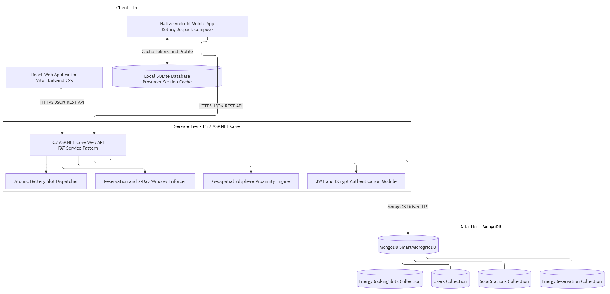
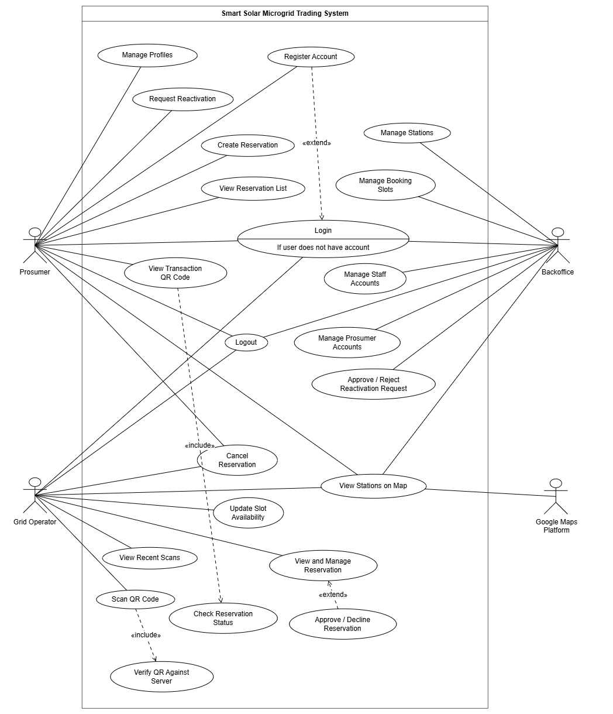
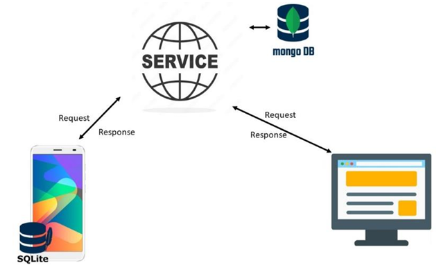

# Smart Solar Microgrid Trading System (Joule)

A client-server enterprise application for trading solar energy through a network of managed microgrid hubs. The system features a centralized C# ASP.NET Core Web API (FAT service architecture pattern) backed by MongoDB, a React web portal for backoffice administration and site operators, and a pure native Android mobile application with local SQLite caching for prosumers and on-site grid operators.

---

## System Architecture & Diagrams

### High-Level Architecture


### System Use Case Diagram


### Visual System Flow


---

## Setup & Running the Application

### Prerequisites
- **.NET 9.0 SDK** (for the Web Service)
- **Node.js 18+ & npm** (for the Web Application)
- **Android Studio Ladybug / Koala** or newer with Android SDK 34+ (for the Mobile Application)
- **MongoDB** instance (Local or MongoDB Atlas)

---

### 1. Web Service (C# ASP.NET Core 9.0 Web API)

1. Open `WebService/SmartMicrogrid.Api/appsettings.json` and configure your MongoDB connection string:
   ```json
   {
     "MongoDb": {
       "ConnectionString": "mongodb://localhost:27017",
       "DatabaseName": "SmartMicrogridDB"
     },
     "Jwt": {
       "Secret": "YourSuperSecretKeyWithAtLeast32CharactersLong!"
     }
   }
   ```

2. Run the Web API from the root directory:
   ```bash
   cd WebService/SmartMicrogrid.Api
   dotnet restore
   dotnet run
   ```
   The API will start listening on `http://localhost:5128` (or configured port). Swagger documentation is available at `http://localhost:5128/swagger`.

3. *(Optional)* Create an initial administrator account using cURL or Swagger:
   ```bash
   curl -X POST http://localhost:5128/api/users \
     -H "Content-Type: application/json" \
     -d '{"username":"admin","password":"ChangeMe123!","role":"Backoffice","fullName":"Admin User","email":"admin@example.com"}'
   ```

---

### 2. Web Application (React + Vite + Tailwind CSS)

1. Navigate to the `WebApp` directory and install dependencies:
   ```bash
   cd WebApp
   npm install
   ```

2. Start the local development server:
   ```bash
   npm run dev
   ```
   The web application will launch at `http://localhost:5173`.

---

### 3. Mobile Application (Pure Native Android with Jetpack Compose & SQLite)

1. Open the `MobileApp` directory directly in Android Studio.
2. Configure `MobileApp/local.properties` with your Google Maps API key and local computer IP:
   ```properties
   MAPS_API_KEY=your_google_maps_api_key
   API_BASE_URL=http://10.0.2.2:5128/
   ```
   *(Note: Use `http://10.0.2.2:5128/` for the Android emulator or your host PC's local Wi-Fi IP e.g. `http://192.168.1.X:5128/` for physical test devices).*

3. Build and install via command line or Android Studio:
   ```bash
   cd MobileApp
   .\gradlew assembleDebug
   .\gradlew installDebug
   ```

---

## Git Repository

**GitHub Link:** https://github.com/3hal0n/smart-solar-microgrid-system

---

## Demo Video

**Walkthrough Video (< 5 Minutes):**  
[JouleDemo.mp4 (OneDrive / SharePoint Link)](https://mysliit-my.sharepoint.com/:v:/g/personal/it22362544_my_sliit_lk/IQBvTgFMRkPJQKGFHGoIvIJgAQ9GXCwDsMBgF1Juv_zKcWQ?e=bAFMzG)

---

## Individual Contributions

### 1. Shalon Fernando (IT22362544)
- **Web API & Backend:** Microgrid node lifecycle management (`StationsController.cs`, `StationService.cs`), 2dsphere geospatial proximity calculations (Haversine & `$geoNear`), node conflict guard preventing deactivation with active reservations, and prosumer dashboard summary aggregation engine (`DashboardController.cs`, `DashboardService.cs`).
- **Web Application:** Microgrid Hubs catalog and detail provisioning views (`StationsPage.jsx`, `StationDetailPage.jsx`), Leaflet/OpenStreetMap coordinate picker modal (`MapPicker.jsx`, `StationForm.jsx`), and shared product shell infrastructure (`AppShell.jsx`, `Sidebar.jsx`, `TopBar.jsx`, `DashboardPage.jsx`).
- **Mobile Application:** Prosumer dashboard screen with live counters and filter sheet (`ProsumerDashboardScreen.kt`), Google Maps interactive hub discovery screen with custom markers and capacity filtering (`MapScreen.kt`), offline-first SQLite cache layer (`DashboardCacheDao.kt`), and branded entry flow (`SplashActivity.kt`, `OnboardingActivity.kt`).

### 2. Dinil Dulneth
- **Web API & Backend:** Energy reservation lifecycle management (`ReservationsController.cs`, `ReservationService.cs`), 7-day scheduling window validation, 12-hour modification/cancellation lockout rule, and secure cryptographic QR token generation and validation.
- **Web Application:** Central reservation administration console (`ReservationsAdminPage.jsx`, `ReservationDetailPage.jsx`) for reviewing, filtering, and managing bookings across all microgrid stations.
- **Mobile Application:** Grid Operator QR code scanner (`OperatorScannerScreen.kt`) built with CameraX and ML Kit for in-person scanning, server-side reservation verification, and energy drop-off finalization.

### 3. Migara Wijesinghe
- **Web API & Backend:** User authentication and staff management (`AuthController.cs`, `UsersController.cs`), JWT token generation, role-based authorization policies (`Backoffice`, `GridOperator`), and BCrypt password hashing.
- **Web Application:** Staff authentication portal (`LoginPage.jsx`) and user administration interface (`UsersPage.jsx`) for managing staff credentials and system access roles.

### 4. Rukshan Dias
- **Web API & Backend:** Prosumer account endpoints (`ProsumersController.cs`, `ProsumerService.cs`) utilizing National Identity Card (NIC) as the unique primary key, pending account approval workflows, and deactivation handling.
- **Web Application:** Prosumer administration dashboard (`ProsumersPage.jsx`, `PendingProsumersPage.jsx`) for reviewing, verifying, and activating pending prosumer registrations.
- **Mobile Application:** Prosumer self-registration flow with NIC validation, user profile management, and account deactivation request interface.
