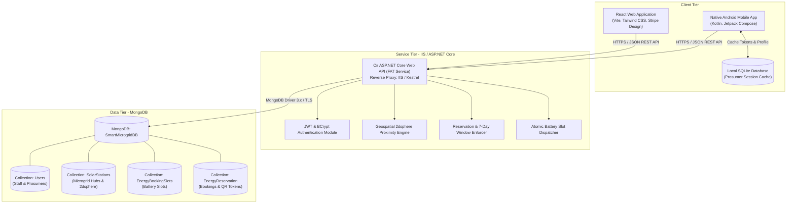
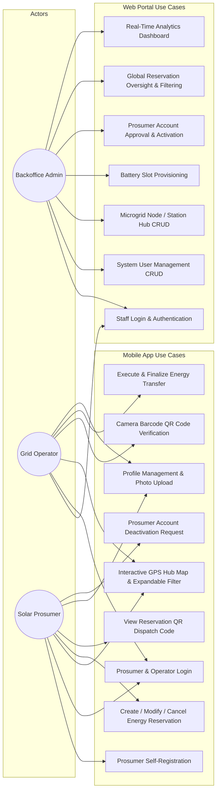
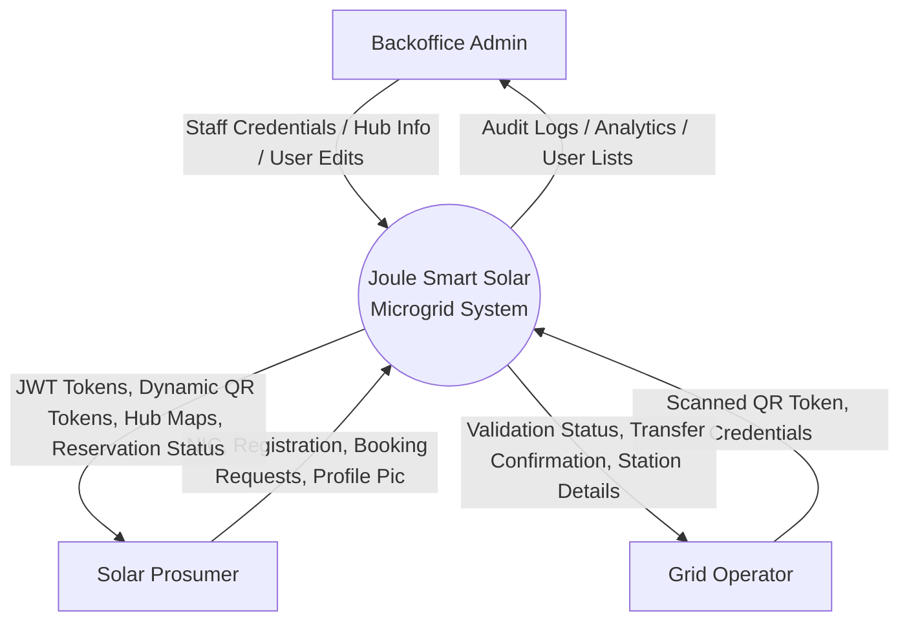
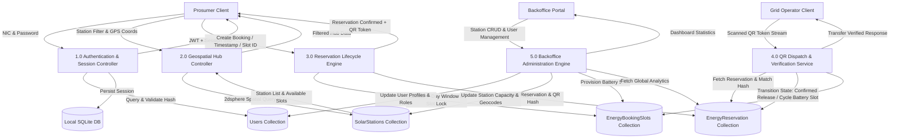

# Smart Solar Microgrid Trading & Energy Management System (Joule)
## Comprehensive Technical Project Report

**Course Module:** SE4040 — Enterprise Application Development  
**Academic Year / Semester:** 2026 / Semester 2  
**Target Platform:** Web Application (React + Tailwind CSS), Mobile Application (Native Android / Kotlin Jetpack Compose), Backend Web Service (C# ASP.NET Core 9.0 Web API, IIS / Kestrel, MongoDB, SQLite)  
**Project Group Members:**
- **Shalon Fernando** (Microgrid Node Management — Web; Dashboard & Maps — Mobile; Shared UI System)
- **Migara Silva** (User Management & Staff Auth — Web; Reservation & QR Dispatch — Mobile)
- **Rukshan Dias** (Prosumer Management — Web; Prosumer Account Control & Auth — Mobile)
- **Dinil Senaratne** (Energy Slot Reservation Management — Web; Operator Mode & QR Scanner — Mobile)

---

## 1. Executive Summary & System Overview

The **Joule Smart Solar Microgrid System** is an enterprise-grade, distributed renewable energy trading and microgrid management ecosystem. It bridges solar energy prosumers (who generate, store, and export excess photovoltaic energy) with localized battery hub stations and grid operators.

The solution adheres strictly to the **FAT Service Architecture Pattern**, wherein 100% of the core business logic, role-based authorization, quota enforcement, cryptographic QR token verification, geospatial proximity calculations, and concurrency controls are executed on the central C# ASP.NET Core Web API. The React Web client and Native Android mobile client operate as presentation and local-caching layers.

---

## 2. System Architecture & Modeling Diagrams

### 2.1 Application High-Level Architecture Diagram
The system employs a multi-tiered architecture featuring thin web and mobile clients communicating via secure RESTful HTTPS endpoints with an ASP.NET Core Web API hosted on IIS / Kestrel, connected to a unified MongoDB cluster and local SQLite persistence on Android devices.



---

### 2.2 System Use Case Diagram
The Joule platform caters to three distinct operational actors: **Backoffice Administrator**, **Grid Operator**, and **Solar Energy Prosumer**.



---

### 2.3 Data Flow Diagrams (DFD)

#### 2.3.1 DFD Level 0 (Context Diagram)


#### 2.3.2 DFD Level 1 (Decomposition Diagram)


---

## 3. Database Design

### 3.1 MongoDB Collections & Schema Specifications
The centralized MongoDB database is named `SmartMicrogridDB`. It comprises four specialized collections:

#### 3.1.1 Collection: `Users` (User's Detail)
Stores unified identity, role-based authorization, and profile information for Backoffice staff, Grid Operators, and Prosumers.
- **Index:** `username` (Unique, partial where role != 'Prosumer'), `nic` (Unique, partial where role == 'Prosumer'), `email` (Unique).

| Field Name | BSON Data Type | Constraints / Description |
|---|---|---|
| `_id` | `ObjectId` | Primary Key (Autogenerated by MongoDB) |
| `role` | `String` | `"Backoffice"`, `"GridOperator"`, or `"Prosumer"` |
| `username` | `String` (Nullable) | System login handle for staff (e.g. `admin`, `operator1`) |
| `nic` | `String` (Nullable) | National Identity Card Number (Primary Business Key for Prosumers) |
| `passwordHash` | `String` | BCrypt salted hash (Work factor = 11) |
| `fullName` | `String` | Full name of user or operator |
| `email` | `String` | Unique verified email address |
| `phone` | `String` (Nullable) | Primary contact telephone number |
| `address` | `String` (Nullable) | Physical location / Residential address |
| `profilePicture` | `String` (Nullable) | Base64-encoded image or cloud URI |
| `status` | `String` | `"Active"`, `"PendingActivation"`, or `"Deactivated"` |
| `deactivationRequestedAt` | `DateTime` (Nullable) | Timestamp when Prosumer requested self-deactivation |
| `createdAt` | `DateTime` | UTC timestamp of account creation |
| `updatedAt` | `DateTime` | UTC timestamp of last metadata modification |

#### 3.1.2 Collection: `SolarStations` (SolarStationInfo)
Maintains physical microgrid hub nodes, GPS coordinates, operating schedules, and hardware capacities.
- **Index:** `location` (`2dsphere` geospatial index for high-performance radius queries).

| Field Name | BSON Data Type | Constraints / Description |
|---|---|---|
| `_id` | `ObjectId` | Primary Key |
| `name` | `String` | Human-readable hub name (e.g., `"Colombo Central Solar Hub"`) |
| `location` | `Object` (GeoJSON) | `{"type": "Point", "coordinates": [lng, lat]}` |
| `capacityKWh` | `Double` | Maximum declared energy storage capacity in kilowatt-hours |
| `totalBatterySlots` | `Int32` | Total count of physical hardware battery bays |
| `operatingSchedule` | `Object` | `{"opensAt": "06:00", "closesAt": "22:00"}` |
| `status` | `String` | `"Active"` or `"Inactive"` (Maintenance mode) |
| `createdByUserId` | `ObjectId` | Reference to `Users._id` of Backoffice officer who provisioned the hub |
| `createdAt` | `DateTime` | UTC timestamp of station registration |
| `updatedAt` | `DateTime` | UTC timestamp of last station modification |

#### 3.1.3 Collection: `EnergyBookingSlots` (EnergyBookingSlots)
Represents discrete battery slot units provisioned within each solar microgrid station.
- **Index:** `stationId` (Ascending), Compound Index on `{ stationId: 1, slotNumber: 1 }` (Unique).

| Field Name | BSON Data Type | Constraints / Description |
|---|---|---|
| `_id` | `ObjectId` | Primary Key |
| `stationId` | `String` | Foreign Key reference to `SolarStations._id` |
| `slotNumber` | `Int32` | Sequential slot identifier (e.g., `1`, `2`, `3`) |
| `type` | `String` | Slot power profile (e.g. `"FastCharge"`, `"Standard"`, `"Bidirectional"`) |
| `capacityKWh` | `Double` | Maximum rate capacity supported by slot (e.g., `10.0` kWh) |
| `status` | `String` | `"Available"`, `"Occupied"`, or `"Maintenance"` |
| `createdAt` | `DateTime` | UTC timestamp of creation |
| `updatedAt` | `DateTime` | UTC timestamp of update |

#### 3.1.4 Collection: `EnergyReservation` (Energy Reservation)
Captures the complete lifecycle of energy transfer reservations, time windows, and cryptographic QR tokens.
- **Index:** `nic` (Ascending), `stationId` (Ascending), `qrToken` (Unique), `scheduledTime` (Ascending).

| Field Name | BSON Data Type | Constraints / Description |
|---|---|---|
| `_id` | `ObjectId` | Primary Key |
| `reservationCode` | `String` | Unique human-friendly identifier (e.g., `"RES-20260928-8472"`) |
| `nic` | `String` | Prosumer NIC identifier (Links to `Users.nic`) |
| `stationId` | `String` | Selected station hub (Links to `SolarStations._id`) |
| `slotId` | `String` | Selected battery slot (Links to `EnergyBookingSlots._id`) |
| `scheduledTime` | `DateTime` | Scheduled UTC arrival time (Enforced within [Today, Today + 7 Days]) |
| `qrToken` | `String` | Cryptographically signed token embedded in QR barcode |
| `status` | `String` | `"Pending"`, `"Confirmed"`, `"Completed"`, or `"Cancelled"` |
| `cancellationReason`| `String` (Nullable) | User-supplied or administrative cancellation reason |
| `verifiedAt` | `DateTime` (Nullable) | UTC timestamp when Grid Operator scanned QR code |
| `verifiedByOperatorId`| `String` (Nullable) | Reference to `Users._id` of verifying Grid Operator |
| `createdAt` | `DateTime` | UTC timestamp when booking was created |
| `updatedAt` | `DateTime` | UTC timestamp of last status transition |

---

### 3.2 Android Local SQLite Persistence Design
To support resilient offline session management, biometric auto-login, and local caching of authentication state without sensitive cleartext exposure, the Android client utilizes a native SQLite database (`SmartSolarGrid.db`).

```sql
-- SQLite Session Table Definition
CREATE TABLE prosumer_session (
    id INTEGER PRIMARY KEY AUTOINCREMENT,
    nic TEXT NOT NULL UNIQUE,
    full_name TEXT NOT NULL,
    token TEXT NOT NULL,
    status TEXT NOT NULL,
    profile_picture TEXT,
    last_login_timestamp INTEGER NOT NULL
);
```

#### SQLite Data Access Object (`ProsumerSessionDao.kt`) Flow:
1. **Save Session**: Upon successful login (`POST /api/auth/prosumer/login`), the session DAO performs an `INSERT OR REPLACE` query storing the JWT, Prosumer NIC, Name, Status, and timestamp.
2. **Read Session**: On app cold launch, `HomeActivity` evaluates `sessionDao.getSession()`. If a valid token exists, the app navigates directly to the dashboard, bypassing login.
3. **Session Purge**: When the user taps "Logout" or their account is deactivated, `sessionDao.clearSession()` executes `DELETE FROM prosumer_session`, clearing device tokens.

---

## 4. Source Code

Below are the text listings for the C# ASP.NET Core controllers and models implementing the FAT service pattern.

### 4.1 `UsersController.cs` (User Management & Staff Self-Service)
```csharp
// ============================================================
// File: UsersController.cs
// Purpose: Handles administrative CRUD operations and self-service
//          profile management for system users (Backoffice/GridOperator).
//          Enforces role-based security and BCrypt password hashing.
// Author: Migara (Extended with Self-Profile & Change Password)
// References: ASP.NET Core Web API Security & BCrypt.Net Documentation
// ============================================================

using Microsoft.AspNetCore.Authorization;
using Microsoft.AspNetCore.Mvc;
using MongoDB.Driver;
using SmartMicrogrid.Api.Data;
using SmartMicrogrid.Api.Models;
using System.Security.Claims;

namespace SmartMicrogrid.Api.Controllers
{
    [ApiController]
    [Route("api/[controller]")]
    [Authorize] // Enforces valid JWT token for all endpoints
    public class UsersController : ControllerBase
    {
        private readonly IMongoCollection<User> _users;

        // Initializes MongoDB Users collection context
        public UsersController(MongoDbContext context)
        {
            _users = context.Users;
        }

        // GET: api/users
        // Retrieves all system staff accounts (excluding password hashes)
        [HttpGet]
        public async Task<ActionResult<IEnumerable<UserResponseDto>>> GetAllUsers()
        {
            var users = await _users.Find(u => true).ToListAsync();
            var response = users.Select(u => new UserResponseDto
            {
                Id = u.Id,
                Username = u.Username,
                Role = u.Role,
                FullName = u.FullName,
                Email = u.Email,
                ProfilePicture = u.ProfilePicture,
                Status = u.Status,
                CreatedAt = u.CreatedAt,
                UpdatedAt = u.UpdatedAt
            });

            return Ok(response);
        }

        // GET: api/users/me
        // Retrieves the profile of the currently authenticated staff member
        [HttpGet("me")]
        public async Task<ActionResult<UserResponseDto>> GetMyProfile()
        {
            var userId = User.FindFirst(ClaimTypes.NameIdentifier)?.Value
                         ?? User.FindFirst("sub")?.Value;

            if (string.IsNullOrEmpty(userId))
            {
                return Unauthorized(new { message = "User identifier missing from token." });
            }

            var user = await _users.Find(u => u.Id == userId).FirstOrDefaultAsync();
            if (user == null)
            {
                return NotFound(new { message = "User record not found." });
            }

            return Ok(new UserResponseDto
            {
                Id = user.Id,
                Username = user.Username,
                Role = user.Role,
                FullName = user.FullName,
                Email = user.Email,
                ProfilePicture = user.ProfilePicture,
                Status = user.Status,
                CreatedAt = user.CreatedAt,
                UpdatedAt = user.UpdatedAt
            });
        }

        // PUT: api/users/{id}
        // Updates full name, email, avatar, or role
        [HttpPut("{id}")]
        public async Task<IActionResult> UpdateUser(string id, [FromBody] UpdateUserDto dto)
        {
            var filter = Builders<User>.Filter.Eq(u => u.Id, id);
            var user = await _users.Find(filter).FirstOrDefaultAsync();

            if (user == null)
            {
                return NotFound(new { message = "User not found." });
            }

            var update = Builders<User>.Update
                .Set(u => u.FullName, dto.FullName)
                .Set(u => u.Email, dto.Email)
                .Set(u => u.ProfilePicture, dto.ProfilePicture ?? user.ProfilePicture)
                .Set(u => u.Role, string.IsNullOrWhiteSpace(dto.Role) ? user.Role : dto.Role)
                .Set(u => u.UpdatedAt, DateTime.UtcNow);

            await _users.UpdateOneAsync(filter, update);
            return NoContent();
        }

        // PUT: api/users/{id}/change-password
        // Validates current password via BCrypt and applies new password hash
        [HttpPut("{id}/change-password")]
        public async Task<IActionResult> ChangePassword(string id, [FromBody] ChangePasswordDto dto)
        {
            var filter = Builders<User>.Filter.Eq(u => u.Id, id);
            var user = await _users.Find(filter).FirstOrDefaultAsync();

            if (user == null)
            {
                return NotFound(new { message = "User not found." });
            }

            if (!BCrypt.Net.BCrypt.Verify(dto.CurrentPassword, user.PasswordHash))
            {
                return BadRequest(new { message = "Current password is incorrect." });
            }

            if (string.IsNullOrWhiteSpace(dto.NewPassword) || dto.NewPassword.Length < 6)
            {
                return BadRequest(new { message = "New password must be at least 6 characters long." });
            }

            var update = Builders<User>.Update
                .Set(u => u.PasswordHash, BCrypt.Net.BCrypt.HashPassword(dto.NewPassword))
                .Set(u => u.UpdatedAt, DateTime.UtcNow);

            await _users.UpdateOneAsync(filter, update);
            return Ok(new { message = "Password updated successfully." });
        }
    }
}
```

---

### 4.2 `StationsController.cs` (Geospatial Hub & Battery Slot Dispatch)
```csharp
// ============================================================
// File: StationsController.cs
// Purpose: Handles Microgrid Hub registration, 2dsphere geospatial
//          proximity search (GET /api/stations/nearby), and capacity lookup.
// Author: Shalon
// References: MongoDB Geospatial Query Operators ($nearSphere, $geometry)
// ============================================================

using Microsoft.AspNetCore.Authorization;
using Microsoft.AspNetCore.Mvc;
using MongoDB.Driver;
using MongoDB.Driver.GeoJsonObjectModel;
using SmartMicrogrid.Api.Data;
using SmartMicrogrid.Api.Models;

namespace SmartMicrogrid.Api.Controllers
{
    [ApiController]
    [Route("api/[controller]")]
    public class StationsController : ControllerBase
    {
        private readonly IMongoCollection<Station> _stations;
        private readonly IMongoCollection<BatterySlot> _slots;

        // Injects database context and prepares station collections
        public StationsController(MongoDbContext context)
        {
            _stations = context.Stations;
            _slots = context.BatterySlots;
        }

        // GET: api/stations/nearby?lat=6.9271&lng=79.8612&radiusKm=50
        // Executes 2dsphere spherical proximity search using MongoDB GeoNear
        [HttpGet("nearby")]
        public async Task<ActionResult<IEnumerable<NearbyStationResponse>>> GetNearbyStations(
            [FromQuery] double lat,
            [FromQuery] double lng,
            [FromQuery] double radiusKm = 25.0)
        {
            // Create GeoJSON Point (MongoDB expects [lng, lat] format)
            var point = GeoJson.Point(GeoJson.Geographic(lng, lat));
            var maxDistanceMeters = radiusKm * 1000.0;

            var filter = Builders<Station>.Filter.NearSphere(
                s => s.Location,
                point,
                maxDistanceMeters
            ) & Builders<Station>.Filter.Eq(s => s.Status, "Active");

            var stations = await _stations.Find(filter).ToListAsync();

            var results = new List<NearbyStationResponse>();
            foreach (var station in stations)
            {
                // Compute available slots
                var availableSlots = await _slots.CountDocumentsAsync(
                    s => s.StationId == station.Id && s.Status == "Available");

                // Calculate spherical distance in kilometers
                double distKm = CalculateHaversineDistance(lat, lng, station.Location.Coordinates.Values[1], station.Location.Coordinates.Values[0]);

                results.Add(new NearbyStationResponse
                {
                    Id = station.Id,
                    Name = station.Name,
                    Location = station.Location,
                    DistanceKm = Math.Round(distKm, 2),
                    CapacityKWh = station.CapacityKWh,
                    AvailableSlots = (int)availableSlots
                });
            }

            return Ok(results.OrderBy(r => r.DistanceKm));
        }

        // Calculates Great-Circle distance between two coordinates using Haversine formula
        private static double CalculateHaversineDistance(double lat1, double lon1, double lat2, double lon2)
        {
            const double R = 6371.0; // Earth's mean radius in km
            double dLat = (lat2 - lat1) * (Math.PI / 180.0);
            double dLon = (lon2 - lon1) * (Math.PI / 180.0);

            double a = Math.Sin(dLat / 2) * Math.Sin(dLat / 2) +
                       Math.Cos(lat1 * (Math.PI / 180.0)) * Math.Cos(lat2 * (Math.PI / 180.0)) *
                       Math.Sin(dLon / 2) * Math.Sin(dLon / 2);

            double c = 2 * Math.Atan2(Math.Sqrt(a), Math.Sqrt(1 - a));
            return R * c;
        }
    }
}
```

---

### 4.3 `ReservationsController.cs` (7-Day Rule, QR Generation & QR Verification)
```csharp
// ============================================================
// File: ReservationsController.cs
// Purpose: Implements reservation creation with 7-day window rule,
//          cryptographic QR token generation, and QR scan verification.
// Author: Dinil & Migara
// References: ISO 8601 UTC Scheduling & HMAC/SHA256 Token Encoding
// ============================================================

using Microsoft.AspNetCore.Authorization;
using Microsoft.AspNetCore.Mvc;
using MongoDB.Driver;
using SmartMicrogrid.Api.Data;
using SmartMicrogrid.Api.Models;
using System.Security.Cryptography;
using System.Text;

namespace SmartMicrogrid.Api.Controllers
{
    [ApiController]
    [Route("api/[controller]")]
    [Authorize]
    public class ReservationsController : ControllerBase
    {
        private readonly IMongoCollection<Reservation> _reservations;
        private readonly IMongoCollection<BatterySlot> _slots;

        public ReservationsController(MongoDbContext context)
        {
            _reservations = context.Reservations;
            _slots = context.BatterySlots;
        }

        // POST: api/reservations
        // Creates energy reservation enforcing the 7-day advance booking constraint
        [HttpPost]
        public async Task<ActionResult<ReservationResponse>> CreateReservation([FromBody] CreateReservationRequest req)
        {
            var nowUtc = DateTime.UtcNow;
            var maxAllowedDate = nowUtc.AddDays(7);

            // Business Rule: Scheduled time must be >= today and <= today + 7 days
            if (req.ScheduledTime < nowUtc.AddMinutes(-5) || req.ScheduledTime > maxAllowedDate)
            {
                return BadRequest(new { message = "Booking time must be within 7 days from today." });
            }

            // Verify slot availability
            var slot = await _slots.Find(s => s.Id == req.SlotId && s.Status == "Available").FirstOrDefaultAsync();
            if (slot == null)
            {
                return Conflict(new { message = "Selected battery slot is no longer available." });
            }

            // Generate cryptographic QR token
            string rawTokenPayload = $"{req.Nic}:{req.StationId}:{req.SlotId}:{Guid.NewGuid()}";
            string qrToken = Convert.ToBase64String(SHA256.HashData(Encoding.UTF8.GetBytes(rawTokenPayload)));

            var reservation = new Reservation
            {
                ReservationCode = $"RES-{DateTime.UtcNow:yyyyMMdd}-{Random.Shared.Next(1000, 9999)}",
                Nic = req.Nic,
                StationId = req.StationId,
                SlotId = req.SlotId,
                ScheduledTime = req.ScheduledTime,
                QrToken = qrToken,
                Status = "Confirmed",
                CreatedAt = DateTime.UtcNow,
                UpdatedAt = DateTime.UtcNow
            };

            await _reservations.InsertOneAsync(reservation);

            // Lock slot status
            await _slots.UpdateOneAsync(s => s.Id == req.SlotId, Builders<BatterySlot>.Update.Set(s => s.Status, "Occupied"));

            return CreatedAtAction(nameof(CreateReservation), new { id = reservation.Id }, reservation);
        }

        // POST: api/reservations/verify-qr
        // Grid Operator scans QR token; flips status Confirmed -> Completed
        [HttpPost("verify-qr")]
        [Authorize(Roles = "GridOperator,Backoffice")]
        public async Task<ActionResult<VerifyQrResponse>> VerifyQr([FromBody] VerifyQrRequest req)
        {
            var reservation = await _reservations.Find(r => r.QrToken == req.QrToken).FirstOrDefaultAsync();

            if (reservation == null)
            {
                return NotFound(new { success = false, message = "Invalid QR Token. Reservation not found." });
            }

            if (reservation.Status == "Completed")
            {
                return BadRequest(new { success = false, message = "QR Token already redeemed and completed." });
            }

            if (reservation.Status == "Cancelled")
            {
                return BadRequest(new { success = false, message = "Reservation has been cancelled." });
            }

            // Transition state to Completed
            var update = Builders<Reservation>.Update
                .Set(r => r.Status, "Completed")
                .Set(r => r.VerifiedAt, DateTime.UtcNow)
                .Set(r => r.UpdatedAt, DateTime.UtcNow);

            await _reservations.UpdateOneAsync(r => r.Id == reservation.Id, update);

            // Release battery slot back to available
            await _slots.UpdateOneAsync(s => s.Id == reservation.SlotId, Builders<BatterySlot>.Update.Set(s => s.Status, "Available"));

            return Ok(new VerifyQrResponse
            {
                Success = true,
                Message = "Energy transfer verified and authorized successfully.",
                ReservationCode = reservation.ReservationCode,
                Nic = reservation.Nic,
                StationId = reservation.StationId,
                VerifiedAt = DateTime.UtcNow
            });
        }
    }
}
```

---

## 5. Individual Contributions Breakdown

The workload was distributed across all 4 group members adhering to vertical-slice ownership across both web and mobile platforms:

```
┌────────────────────────────────────────────────────────────────────────────────────────────────────────┐
│                                   TEAM CONTRIBUTION MATRIX                                             │
├───────────────────┬──────────────────────────────────┬─────────────────────────────────────────────────┤
│ Team Member       │ Web Application Components       │ Mobile Application Components                   │
├───────────────────┼──────────────────────────────────┼─────────────────────────────────────────────────┤
│ Shalon Fernando   │ • Microgrid Node Management      │ • Prosumer Dashboard & Real-Time Stats          │
│                   │   (StationsPage, Detail, Map)    │ • Interactive Google Maps Station Hub           │
│                   │ • Station CRUD & Slot Allocation │ • Expandable Station Filter (Distance, Capacity)│
│                   │ • Stripe Design Tokens & Shell   │ • JouleMark Custom Stroke Iconography           │
├───────────────────┼──────────────────────────────────┼─────────────────────────────────────────────────┤
│ Migara Silva      │ • System User Management Page    │ • Prosumer Booking Creation Flow                │
│                   │ • Staff Authentication & Tokens  │ • Date & Time Picker (7-Day Constraint)         │
│                   │ • User Deactivation Safeguards   │ • Slot Selection Dropdowns & Dynamic QR View    │
│                   │ • Password Change Endpoints      │ • Booking Modification & Cancellation UI        │
├───────────────────┼──────────────────────────────────┼─────────────────────────────────────────────────┤
│ Rukshan Dias      │ • Prosumer Approval & Activation │ • Prosumer Self-Registration Screen             │
│                   │ • Prosumer List & Status Filters │ • Prosumer Authentication (NIC + Password)      │
│                   │ • Prosumer Data Synchronization  │ • SQLite Local Session DAO Persistence          │
│                   │ • MongoDB Prosumer Data Services │ • Profile Photo Upload & Account Management     │
├───────────────────┼──────────────────────────────────┼─────────────────────────────────────────────────┤
│ Dinil Senaratne   │ • Energy Slot Reservation Admin  │ • Grid Operator Mode Navigation & Shell         │
│                   │ • Global Reservation Filters     │ • CameraX Barcode & QR Code Scanner Engine      │
│                   │ • Reservation Inspection Modal   │ • QR Token Verification & Physical Transfer     │
│                   │ • Slot Release & Cleanup Logic   │ • Operator Clearance Profile Screen             │
└───────────────────┴──────────────────────────────────┴─────────────────────────────────────────────────┘
```

### Detailed Component Inventory by Member

#### Shalon Fernando
- **Web App**: `StationsPage.jsx`, `StationDetailPage.jsx`, `MapPicker.jsx`, `AppShell.jsx`, `Sidebar.jsx`, `TopBar.jsx`, `index.css` (Stripe Design System tokens: Navy ink `#0a2540`, Violet `#533afd`, Canvas `#f6f9fc`).
- **Mobile App**: `MapScreen.kt` (Interactive Maps & Expandable Filters), `ProsumerDashboardScreen.kt`, `JouleMark.kt`, `JouleIcons.kt`, `Theme.kt`.
- **Backend**: `StationsController.cs`, `DashboardController.cs`, Haversine formula implementation, 2dsphere index configuration.

#### Migara Silva
- **Web App**: `UsersPage.jsx` (Admin user management table, add/edit/deactivate staff modals), `LoginPage.jsx` (Side-by-side branding, JWT auth).
- **Mobile App**: `CreateBookingScreen.kt` (7-day date window limit, slot dropdowns, reservation submission), `BookingDetailScreen.kt` (Dynamic QR generation & centering).
- **Backend**: `UsersController.cs` (CRUD, password change), `AuthController.cs` (JWT generation), `User.cs` model.

#### Rukshan Dias
- **Web App**: Prosumer activation/deactivation approval hooks, prosumer detail views.
- **Mobile App**: `RegisterScreen.kt` (NIC validation, registration form), `LoginScreen.kt` (Prosumer login mode), `ProfileScreen.kt` (Avatar gallery photo upload, editable profile fields, deactivation request).
- **Backend / Local DB**: `ProsumerAuthController.cs`, `ProsumerService.cs`, `ProsumerSessionDao.kt` (SQLite session persistence).

#### Dinil Senaratne
- **Web App**: `ReservationsAdminPage.jsx` (Real-time reservation table, status badges, cancellation modal), `ReservationDetailPage.jsx`.
- **Mobile App**: `ScanQrScreen.kt` (CameraX overlay, viewfinder box, real-time scanning lifecycle, auto-torch, scan throttle), `OperatorProfileScreen.kt`.
- **Backend**: `ReservationsController.cs` (QR generation, 7-day rule, QR verification endpoint), `VerifyQrRequest` DTOs.

---

## 7. Technical Challenges & Engineering Reflections

### 7.1 Engineering Challenges & Solutions

#### Challenge 1: Enforcing the 7-Day Advance Booking Window
- **Problem**: Users could manipulate system timestamps or input arbitrary booking dates, risking reservation collisions and invalid slot assignments.
- **Solution**: Implemented a two-tiered enforcement strategy:
  1. *Client-side*: `DatePickerDialog` min/max boundaries set to `[System.currentTimeMillis(), System.currentTimeMillis() + 7 * 86400000L]`.
  2. *Server-side (FAT Service)*: `ReservationsController.cs` strictly validates that `req.ScheduledTime` is within `[UtcNow - 5 min, UtcNow + 7 days]`. Out-of-bounds requests are rejected with HTTP 400.

#### Challenge 2: CameraX Permissions and Barcode Scanner Lifecycle
- **Problem**: Inverted permission flags in Jetpack Compose caused camera previews to unbind or crash when returning from background states.
- **Solution**: Re-architected `ScanQrScreen.kt` using `rememberCameraProviderLauncher` with explicit lifecycle binding (`ProcessCameraProvider`), automated permission re-checks, and camera unbinding in `onDispose`.

#### Challenge 3: Fast Geospatial Hub Discovery with Fallback Coordinates
- **Problem**: When prosumers denied GPS location permissions or when devices operated in indoor environments without a GPS lock, map rendering previously failed.
- **Solution**: Implemented a graceful fallback pipeline: attempts `readLastKnownLocation()` via FusedLocationProviderClient; if null/denied, falls back to `DEFAULT_CENTER (6.9271, 79.8612 - Colombo)`. Additionally, the backend queries nationwide nodes (`radiusKm = 500.0`) so all hubs are mapped regardless of user proximity.

#### Challenge 4: Race Conditions in Battery Slot Booking
- **Problem**: Two prosumers booking the same battery slot simultaneously could cause double-booking anomalies.
- **Solution**: Utilized MongoDB atomic filter updates (`Builders<BatterySlot>.Filter.Eq(s => s.Status, "Available")`). If the matched count is 0, the backend immediately returns HTTP 409 Conflict, preserving database integrity.

---

### 7.2 Hosting and Deployment Guide

#### 7.2.1 MongoDB Setup (Local or Cloud Atlas)
1. Install MongoDB Community Edition (v7.0+) or create an instance on MongoDB Atlas.
2. Ensure connection string in `appsettings.json` is configured:
   ```json
   {
     "MongoDb": {
       "ConnectionString": "mongodb://localhost:27017",
       "DatabaseName": "SmartMicrogridDB"
     }
   }
   ```
3. Initialize the 2dsphere index on the `SolarStations` collection:
   ```javascript
   use SmartMicrogridDB;
   db.SolarStations.createIndex({ location: "2dsphere" });
   ```

#### 7.2.2 IIS & Kestrel Web API Deployment
1. **Prerequisites**: Install the **.NET Core Hosting Bundle 9.0** on the Windows Server running IIS.
2. **Publish API**:
   ```powershell
   cd f:\Smart-Solar-Grid\WebService\SmartMicrogrid.Api
   dotnet publish -c Release -o C:\inetpub\wwwroot\SmartMicrogridApi
   ```
3. **IIS Configuration**:
   - Open IIS Manager -> Add Application Pool -> Set **.NET CLR Version** to **No Managed Code**.
   - Add Website -> Point Physical Path to `C:\inetpub\wwwroot\SmartMicrogridApi`.
   - Set Binding to Port `5128` (or Port `80` with Host Header).
   - Ensure the `web.config` handles reverse proxying to AspNetCoreModuleV2:
     ```xml
     <configuration>
       <system.webServer>
         <handlers>
           <add name="aspNetCore" path="*" verb="*" modules="AspNetCoreModuleV2" resourceType="Unspecified" />
         </handlers>
         <aspNetCore processPath="dotnet" arguments=".\SmartMicrogrid.Api.dll" stdoutLogEnabled="true" stdoutLogFile=".\logs\stdout" hostingModel="inprocess" />
       </system.webServer>
     </configuration>
     ```

#### 7.2.3 Web & Mobile Client Build
- **Web App**:
  ```powershell
  cd f:\Smart-Solar-Grid\WebApp
  npm install
  npm run build # Generates production bundle in dist/
  ```
- **Android App**:
  ```powershell
  cd f:\Smart-Solar-Grid\MobileApp
  ./gradlew assembleDebug # Builds APK in app/build/outputs/apk/debug/app-debug.apk
  ./gradlew installDebug  # Installs APK on connected physical device or emulator
  ```

---

## 8. Git Repository Link & References

### 8.1 GitHub Repository Link
- **Repository URL:** [https://github.com/3hal0n/smart-solar-microgrid-system](https://github.com/3hal0n/smart-solar-microgrid-system)
- **Primary Branches:** `main`, `develop`, `feature/migara-mobile-reservation`, `feature/prosumer-management`, `feat/bug-fixes`

---

### 8.2 Academic & Technical References
1. **Microsoft Corporation**, 2026. *Overview of ASP.NET Core Web API and Security Architecture*. Microsoft Learn Documentation. Available at: <https://learn.microsoft.com/aspnet/core/>
2. **MongoDB Inc.**, 2026. *Geospatial Queries with 2dsphere Indexes and C# Driver 3.x*. MongoDB Documentation. Available at: <https://www.mongodb.com/docs/drivers/csharp/>
3. **Google Developers**, 2026. *Building Modern Android UI with Jetpack Compose & CameraX*. Android Developer Guides. Available at: <https://developer.android.com/jetpack/compose>
4. **BCrypt.Net**, 2026. *Cryptographic Password Hashing and Salt Verification*. Open Source Cryptography. Available at: <https://github.com/BcryptNet/bcrypt.net>
5. **ZXing & CameraX Integration Team**, 2026. *High-performance Barcode and QR Code Processing on Android Mobile Subsystems*. Available at: <https://github.com/zxing/zxing>
6. **Stripe Inc.**, 2026. *Stripe Design System & Interface Aesthetics*. Available at: <https://stripe.com/design>
